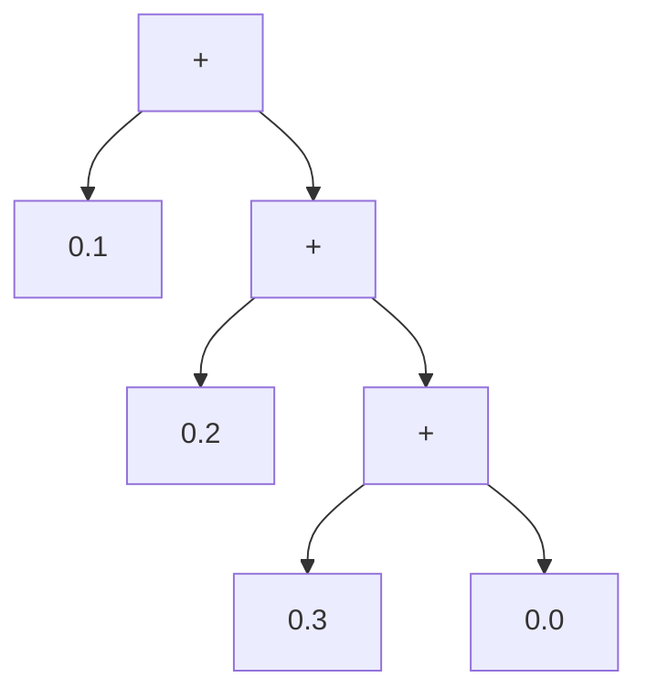
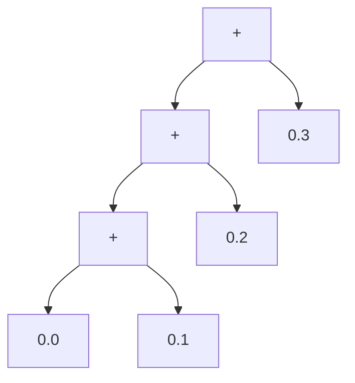

```lean4
import Batteries.Lean.Float
```

# Loops

Let's get something out of the way: Lean does support the kind of loops that
you find in imperative languages such as Python. In Python you can define

```python
def sum(xs : list[float]) -> float:
  s = 0.0
  for x in xs:
    s = s + x
  return s
```

and get

```pycon
>>> sum([0.1, 0.2, 0.3])
0.6000000000000001
```
In Lean there is a very similar construct:

```lean4
namespace Imperative

def sum (xs : List Float) : Float := Id.run do
  let mut acc := 0.0
  for x in xs do
    acc := acc + x
  return acc

#eval sum [0.1, 0.2, 0.3]
-- 0.600000

#eval sum [0.1, 0.2, 0.3] == 0.1 + 0.2 + 0.3
-- true

end Imperative
```

However, this is not a fundamental construct, merely a syntactic layer that
gets reinterpreted as a pure functional construction without a for loop
and mutable variables. We will drop that kind of constructs until we have
a better grasp of what functional programming can do and how monads can
restore a semblance of imperative code in a functional world.

In Lean, given that we expect our `sum` function to have the type
`List Float → Float`, it's very natural to try and pattern
match on the list to compute the sum. The rest of the code almost writes
itself! We end up with:

```lean4
namespace V0

def sum (xs : List Float) : Float :=
  match xs with
  | [] => 0.0
  | x :: xs => x + sum xs

#check sum

#eval sum [0.1, 0.2, 0.3]
-- 0.600000

end V0
```

Success! Well, not quite, since the result of our functional sum may not
agree with the output of the imperative one. Despite the same display of
digits,

```lean4
#eval 0.1 + 0.2 + 0.3
-- 0.600000

#eval V0.sum [0.1, 0.2, 0.3]
-- 0.600000
```

we actually have

```lean4
#eval V0.sum [0.1, 0.2, 0.3] == 0.1 + 0.2 + 0.3
-- false
```

How come? To begin with, Lean calls the `Float.toString` method to display a
string representation of a float and this method does not provide enough digits
to characterize a float uniquely.

To overcome this issue, we can import `Batteries.Lean.Float`, which gives
use a new `Float.toStringFull` method that will provide all the digits of
a float.

```lean4
#eval IO.println (0.1 + 0.2 + 0.3).toStringFull
-- 0.600000000000000088817841970012523233890533447265625
```

This results matches what Python produces:

```python
>>> x = 0.0 + 0.1 + 0.2 + 0.3
>>> print(f"{x:.100g}")
0.600000000000000088817841970012523233890533447265625
```

On the other hand

```lean4
#eval IO.println  (V0.sum [0.1, 0.2, 0.3]).toStringFull
-- 0.59999999999999997779553950749686919152736663818359375
```

OK, now we understand that our computations have different results, but we
still need to understand why!

TODO:
  - default `+` is left-assoc (hint : over the +)
  - repeated use of referential transparency to see what `V0.sum` computes.


```lean
V0.sum [0.1, 0.2, 0.3]
-> V0.sum (0.1 :: [0.2, 0.3])
-> 0.1 + V0.sum [0.2, 0.3]
-> 0.1 + V0.sum (0.2 :: [0.3])
-> 0.1 + (0.2 + V0.sum [0.3])
-> 0.1 + (0.2 + V0.sum (0.3 :: []))
-> 0.1 + (0.2 + (0.3 + V0.sum []))
-> 0.1 + (0.2 + (0.3 + 0.0))
```



OTOH, it's pretty clear that our pseudo-imperative version computes

```lean
((0.0 + 0.1) + 0.2) + 0.3
```



What are loops used actually for? If you exclude loops that produce some
side-effect, for loops at there core typically:
- read some initial state,
- iterate over a collection, and at each step use the new element from the
collection and the current state to update the state until the collection is
fully traversed.

The product of the loop is the final value of the state.


Note: for loops over a collection *terminate*. While/repeat loops, that's unclear...

TODO: easier to delay tail-recursive concept to the left-associative version
of the sum since

Note that when we do that kind of recursion, the multiple calls to `sum`
that occurs are still "alive" on the call stack until we reach the empty
list, since we have to keep the function variable `x` to make a sum with
the partial sum to be able to remove the function from the call stack.
This will ultimately lead us to a stack overflow for large lists of floats.

```lean4
#check List.range
-- List.range (n : Nat) : List Nat

#eval List.range 3
-- [0, 1, 2]

#eval 3 |> List.range |>.map (fun i => Float.ofNat (i + 1) / 10.0) |> sum
-- 0.600000

#eval 100 |> List.range |>.map (fun i => Float.ofNat (i + 1) / 10.0) |> sum
-- 505.000000

#eval 100_000 |> List.range |>.map (fun i => Float.ofNat (i + 1) / 10.0) |> sum
-- 500005000.000000

#eval 1_000_000 |> List.range |>.map (fun i => Float.ofNat (i + 1) / 10.0) |> sum
-- 50000050000.000000
```

```lean
#eval 10_000_000 |> List.range |>.map (fun i => Float.ofNat (i + 1) / 10.0) |> sum
-- Server process crashed, likely due to a stack overflow or a bug.
```

This accumulation of functions environment on the call stack has to happen
because there tasks are not finished after the recursive call. If instead
we manage to make the recursive call the last call of the function,
that is if our function is not only recursive but **tail-recursive**,
since Lean implements **tail-call optimization**, we can grow our list
only limited by the memory allocated to our process, not by the size of
the stack.

The trick to do that is to "push" the state each function is still holding,
here the float which is meant to be added to the sum,
to the next function. So we need an auxiliary function

```lean4
def sumAux (xs : List Float) (x0 : Float) : Float :=
  match xs with
  | [] => x0
  | x :: xs => sumAux xs (x + x0)

def sum' (xs : List Float) : Float :=
  sumAux xs 0.0

#eval 1_000_000 |> List.range |>.map (fun i => Float.ofNat (i + 1) / 10.0) |> sum'
-- 50000050000.000000
```

Expensive but works!
```lean
#eval 10_000_000 |> List.range |>.map (fun i => Float.ofNat (i + 1) / 10.0) |> sum'
-- 5000000500000.000000

Note that Python doesn't implement tail-call optimization so the translation
of this pattern to Python will still create a stack overflow.
```

Now if we think for a minute we have not exactly performed the same computation
in Python and in Lean. In Python our initial loop has computed

```python
>>> ((0.0 + 0.1) + 0.2) + 0.3
0.6000000000000001
```

which is the same as

```python
>>> 0.0 + 0.1 + 0.2 + 0.3
0.6000000000000001
```

since `+` is left-associative in Python.

The full precision can be displayed with

```python
>>> x = 0.0 + 0.1 + 0.2 + 0.3
>>> print(f"{x:.100g}")
0.600000000000000088817841970012523233890533447265625
```

Lean has the same convention: `+` is left-associative, so if we ask for the
full-precision display (we need to import `Batterries.Lean.Float` for that),
we get:

```lean4
#eval 0.0 + 0.1 + 0.2 + 0.3 |>.toStringFull |> IO.println
-- 0.600000000000000088817841970012523233890533447265625

#eval ((0.0 + 0.1) + 0.2) + 0.3 |>.toStringFull |> IO.println
-- 0.600000000000000088817841970012523233890533447265625

#eval (0.0 + 0.1 + 0.2 + 0.3) == (((0.0 + 0.1) + 0.2) + 0.3)
-- true
```

But our computation of the sum says something different:

```lean4
#eval sum [0.1, 0.2, 0.3] |>.toStringFull |> IO.println
-- 0.59999999999999997779553950749686919152736663818359375

#eval sum' [0.1, 0.2, 0.3] |>.toStringFull |> IO.println
-- 0.59999999999999997779553950749686919152736663818359375
```
