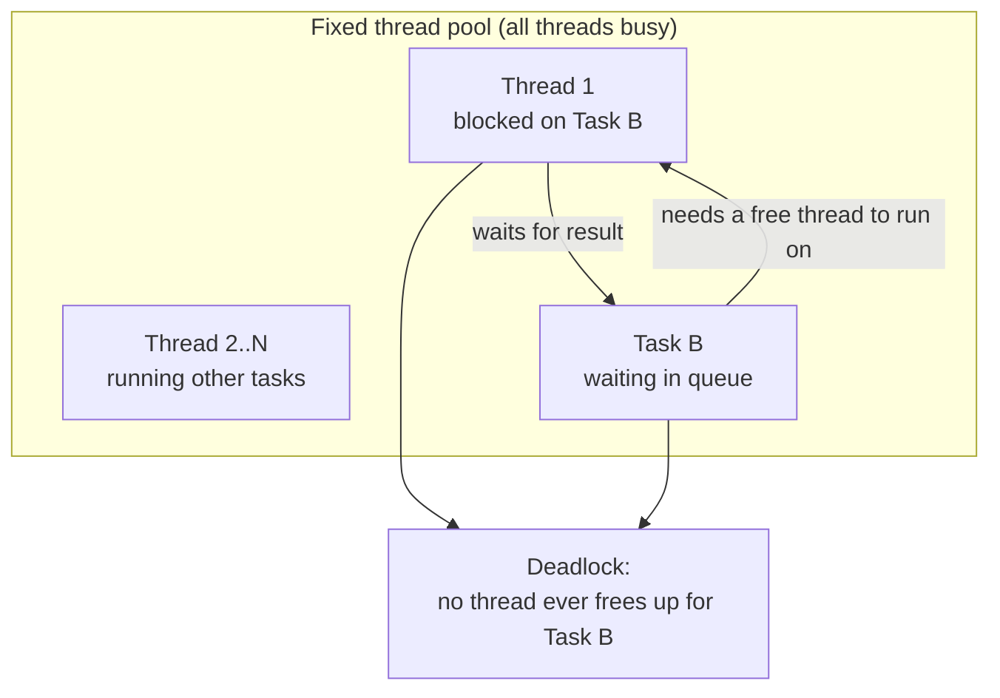

```lean4
import Mathlib
import Lake.Util.Task -- Now `Task` is a `Monad`
```

```lean4
set_option pp.showLetValues true
```

# Tasks

## Pure Tasks

The `Task` structure is a store of value; you put your value in a task with
`Task.pure` and get it afterwards with `Task.get`.


```lean4
#print Task
-- structure Task.{u} (α : Type u) : Type u
-- number of parameters: 1
-- fields:
--   Task.get : α
-- constructor:
--   Task.pure.{u} {α : Type u} (get : α) : Task α


#eval
  let task := Task.pure "Hello world!"
  -- compute something else and when you are ready...
  task.get
-- "Hello world!"
```

... and that's not very exciting!

The magic really starts with `Task.spawn` which
  - takes a function which evaluates an expression,
  - creates a task around it and schedule it to be executed.

The scheduler can use any available thread in a fixed thread pool.
By default, there are as many threads in this pool as
there are processing units in the computer.

On my Linux computer, I can call the system command `nproc` to get this
number:


```lean4
#eval do
  let out ← IO.Process.run { cmd := "nproc" }
  IO.println out
-- 12
```

Afterwards, you get the computed value from the task as usual with `Task.get`,
except that you may have to wait the time necessary for the scheduler
to effectively start and complete the task.

Note that the expression of the value to compute is wrapped into a function
to defer its evaluation.

```lean4
#eval (dbg_trace "now"; 1 + 1)
-- now
-- 2

def oneAddOne (_ : Unit) :=
  dbg_trace "now"
  1 + 1
-- Nothing gets printed

#eval oneAddOne ()
-- now
-- 2
```

`Task.spawn` requires a function "without argument" which does not exist
strictly speaking in Lean (other than as a value which is not a function!).
But we get around it by asking for a function whose argument is of type
`Unit`.

`Unit` has actually a single term: `unit`, which is also available as `()`.
Therefore, the argument given to such a function carry no information.

```lean4
#print Unit
-- @[reducible] def Unit : Type :=
-- PUnit.{1}

#print PUnit
-- inductive PUnit.{u} : Sort u
-- number of parameters: 0
-- constructors:
-- PUnit.unit : PUnit.{u}
```

The full signature of `Task.spawn`:

```lean4
#check Task.spawn
-- Task.spawn.{u} {α : Type u}
-- (fn : Unit → α) (prio : Task.Priority := Task.Priority.default) : Task α
```

Now a more realistic use of the `Task` API:

```lean4
#eval
  let deferredValue := fun (_ : Unit) => "Hello" ++ " " ++ "world!"
  let task := Task.spawn deferredValue
  -- compute something else and when you are ready...
  task.get
-- "Hello world!"
```

Parallel computations
--------------------------------------------------------------------------------


Tasks make it easy to use all the processing unit to achieve a better
performance, especially when the computations you need to do are unrelated.
For example, we can reimplement a paralle version of `List.map` using tasks.

```lean4
#check List.map
-- List.map.{u_1, u_2} {α : Type u_1} {β : Type u_2}
-- (f : α → β) (l : List α) : List β
```

Implémentation of `List.map`:

```lean
def List.map (f : α → β) : (l : List α) → List β
  | nil       => nil
  | cons a as => cons (f a) (map f as)
```

```lean4
def List.parMap {α β} (f : α → β) (l : List α) : List β :=
  let tasks := l.map (fun x => Task.spawn (fun _ => f x))
  tasks.map (fun task => task.get)

#eval 8 |> List.range |>.map (·^2)
-- [0, 1, 4, 9, 16, 25, 36, 49]

#eval 8 |> List.range |>.parMap (·^2)
-- [0, 1, 4, 9, 16, 25, 36, 49]
```

Let's benchmark this!

> [!WARNING]
> Benchmarking of pure functions can be tricky, see for example this
> [Control run-time execution of pure functions](https://github.com/leanprover/lean4/issues/8591)
> issue.

```lean4
@[noinline]
def mapSquare : IO (List Nat) :=
  let deferred := fun (_ : Unit) => 8 |> List.range |>.map (· ^ 2)
  IO.lazyPure deferred

@[noinline]
def parMapSquare : IO (List Nat) :=
  let deferred := fun (_ : Unit) => 8 |> List.range |>.parMap (· ^ 2)
  IO.lazyPure deferred

#eval do
  IO.println (← timeit "sequential map" mapSquare)
  IO.println (← timeit "parallel map" parMapSquare)
-- sequential map 0.142ms
-- [0, 1, 4, 9, 16, 25, 36, 49]
-- parallel map 0.947ms
-- [0, 1, 4, 9, 16, 25, 36, 49]
```

For these super simple function evaluation, the overhead of threads
is so important that it totally negates the benefit of using several
processing units; we are worse with the parallel map than the
sequential map.

```lean4
#eval 0.142 / 0.947
-- 0.149947
```

However, for heavy computation, things are different:

```lean4
partial def collatz (n start : Nat) : Nat :=
  if n == 0 then
    start
  else if start % 2 == 0 then
    collatz (n - 1) (start / 2)
  else
    collatz (n - 1) (3 * start + 1)

def n := 1_000_000


-- TODO: parametrize by the map function and the range of initial values?
@[noinline]
def mapCollatz : IO (List Nat) :=
  let deferred := fun (_ : Unit) => 8 |> List.range |>.map (collatz n)
  IO.lazyPure deferred

@[noinline]
def parMapCollatz : IO (List Nat) :=
  let deferred := fun (_ : Unit) => 8 |> List.range |>.parMap (collatz n)
  IO.lazyPure deferred

#eval do
  IO.println (← timeit "sequential map" mapCollatz)
  IO.println (← timeit "parallel map" parMapCollatz)
-- sequential map 3.98s
-- [0, 4, 1, 1, 2, 2, 2, 1]
-- parallel map 1.2s
-- [0, 4, 1, 1, 2, 2, 2, 1]
```

Now the parallel code runs faster than the sequential code, but due to the
threads overhead, we don't get a 8x performance.

```lean4
#eval 3.98 / 1.2
-- 3.316667
```

Tasks dependencies
--------------------------------------------------------------------------------

### Deadlock

There is a subtle issue with the model of a thread pool with a fixed number
of threads. If your thread pool is full and you need to get the result of a task
on one thread that all the tasks on the other thread depend on, but your thread
depends on a task that has not been scheduled yet... then you're stuck!
This is a deadlock.



To avoid such deadlocks, Lean will temporarily increase the maximum threadpool
size while waiting for the result.

Sequencing
--------------------------------------------------------------------------------

The creation of threads can be costly, so we would like not to have extra
threads when we don't need them. An important use case concerns the scheduling
of a task that depends on the result of another one.

For example, consider the computation of `0 + 1 + ... + 999` in a task and
then the computation of the successor of the result in another task.

```lean4
def deferredSum (_ : Unit) : Nat :=
  (List.range 1_000).foldl (· + ·) 0

def succ (n : Nat) : Nat :=
  n + 1
```

With the current tools that we currently have, we could start two threads
at once, but let the second thread block until the result of the first
one is available.

```lean4
#eval do
  let task1 : Task Nat := Task.spawn deferredSum
  let task2 : Task Nat := Task.spawn (fun _ => task1.get |> succ)
  return task2.get
-- 499501
```

There is actually a more idiomatic and cheaper way to do this.
With `Task.bind`, we can register the second task as a continuation
of the first one when it's done, running on the same thread:

```lean4
#eval do
  let task1 : Task Nat := Task.spawn deferredSum
  let task2 : Task Nat := task1.bind (fun n => Task.spawn (fun _ => succ n))
  return task2.get
-- 499501
```

Or, since bind always create a new task, simply:

```lean4
#eval do
  let task1 : Task Nat := Task.spawn deferredSum
  let task2 : Task Nat := task1.bind (fun n => Task.pure n)
  return task2.get
-- 499501
```

Actually `Task.pure` and `Task.bin` give `Task` a `Monad` structure,
hence we can reimplement that code as:

```lean4
#eval (do
  let n ← Task.spawn deferredSum
  Task.spawn (fun _ => n + 1)
).get
-- 499501
```

Or again, the even simpler

```lean4
#eval (do
  let n ← Task.spawn deferredSum
  return n + 1
).get
-- 499501
```

MapReduce
--------------------------------------------------------------------------------

In the canonical MapReduce example, you distribute the computation of the
count of each word in a set of documents:

```lean4
abbrev CountDict := Std.HashMap String Nat

def count (words : List String) : CountDict :=
  words.foldl (init := {}) fun dict word =>
    let count := dict.getD word 0
    dict.insert word (count + 1)

#eval "to be or not to be that is the question" |>.splitOn " " |> count
-- Std.HashMap.ofList [("to", 2), ("the", 1), ("is", 1), ("or", 1), ("question", 1), ("that", 1), ("not", 1), ("be", 2)]

def corpus := [
  "to be or not to be that is the question",
  "all that glitters is not gold",
  "actions speak louder than words",
  "knowledge is power",
  "the pen is mightier than the sword",
  "a picture is worth a thousand words",
  "practice makes perfect",
  "better late than never",
  "honesty is the best policy",
  "where there is a will there is a way"
].map (·.splitOn " ")

#eval corpus.parMap count
-- [Std.HashMap.ofList [("to", 2), ("the", 1), ("is", 1), ("or", 1), ("question", 1), ("that", 1), ("not", 1), ("be", 2)],
--  Std.HashMap.ofList [("all", 1), ("is", 1), ("gold", 1), ("that", 1), ("not", 1), ("glitters", 1)],
--  Std.HashMap.ofList [("than", 1), ("louder", 1), ("words", 1), ("speak", 1), ("actions", 1)],
--  Std.HashMap.ofList [("knowledge", 1), ("is", 1), ("power", 1)],
--  Std.HashMap.ofList [("than", 1), ("is", 1), ("the", 2), ("mightier", 1), ("pen", 1), ("sword", 1)],
--  Std.HashMap.ofList [("is", 1), ("words", 1), ("worth", 1), ("thousand", 1), ("a", 2), ("picture", 1)],
--  Std.HashMap.ofList [("practice", 1), ("perfect", 1), ("makes", 1)],
--  Std.HashMap.ofList [("than", 1), ("better", 1), ("never", 1), ("late", 1)],
--  Std.HashMap.ofList [("the", 1), ("is", 1), ("honesty", 1), ("policy", 1), ("best", 1)],
--  Std.HashMap.ofList [("is", 2), ("where", 1), ("way", 1), ("a", 2), ("there", 2), ("will", 1)]]

#check Std.HashMap.fold
-- Std.HashMap.fold.{u, v, w} {α : Type u} {β : Type v} {x✝ : BEq α} {x✝¹ : Hashable α} {γ : Type w}
--   (f : γ → α → β → γ)
--   (init : γ)
--   (b : Std.HashMap α β)
--   : γ

def mergeCounts (base update : CountDict) : CountDict :=
  -- Iterate on the update
  update.fold (init := base)
    fun dict word count =>
      let baseCount := dict.getD word 0
      dict.insert word (baseCount + count)

def reduceCounts (counts : List CountDict) : CountDict :=
  counts.foldl (init := {}) mergeCounts

#eval corpus.parMap count |> reduceCounts
-- Std.HashMap.ofList [("knowledge", 1),
--  ("mightier", 1),
--  ("policy", 1),
--  ("better", 1),
--  ("worth", 1),
--  ("that", 2),
--  ("thousand", 1),
--  ("where", 1),
--  ("pen", 1),
--  ("there", 2),
--  ("way", 1),
--  ("actions", 1),
--  ("sword", 1),
--  ("a", 4),
--  ("practice", 1),
--  ("is", 8),
--  ("gold", 1),
--  ("question", 1),
--  ("not", 2),
--  ("late", 1),
--  ("glitters", 1),
--  ("all", 1),
--  ("than", 3),
--  ("or", 1),
--  ("words", 2),
--  ("power", 1),
--  ("never", 1),
--  ("will", 1),
--  ("picture", 1),
--  ("be", 2),
--  ("to", 2),
--  ("louder", 1),
--  ("the", 4),
--  ("honesty", 1),
--  ("makes", 1),
--  ("perfect", 1),
--  ("speak", 1),
--  ("best", 1)]
```

Note: give that that we actually have a sequential reduce,
we could use bind to (maybe) avoid a bunch of unnecessary extra thread
creations due to the many gets we are doing.

```lean4
def countTask (words : List String) : Task CountDict :=
  Task.spawn fun _ => count words

#eval
  let words := "to be or not to be that is the question".splitOn " "
  let task := countTask words
  task.get
-- Std.HashMap.ofList [("to", 2), ("the", 1), ("is", 1), ("or", 1), ("question", 1), ("that", 1), ("not", 1), ("be", 2)]

#check Task.bind

-- def reduceCountTasks (countTasks : List (Task CountDict)) : Task CountDict :=
--   let init := Task.spawn fun _ => {} -- start with the empty count
--   countTasks.foldl (init := init) fun countTask newCountTask =>
--     sorry

def reduceCountTasks (countTasks : List (Task CountDict)) : Task CountDict := do
  let mut counts : List CountDict := []
  for task in countTasks do
    counts := (← task) :: counts
  return reduceCounts counts.reverse

#eval
  let countTasks := corpus.map countTask
  reduceCountTasks countTasks |>.get
-- Std.HashMap.ofList [("knowledge", 1),
--  ("mightier", 1),
--  ("better", 1),
--  ("policy", 1),
--  ("worth", 1),
--  ("that", 2),
--  ("thousand", 1),
--  ("where", 1),
--  ("pen", 1),
--  ("actions", 1),
--  ("there", 2),
--  ("a", 4),
--  ("way", 1),
--  ("sword", 1),
--  ("practice", 1),
--  ("is", 8),
--  ("gold", 1),
--  ("question", 1),
--  ("not", 2),
--  ("glitters", 1),
--  ("late", 1),
--  ("all", 1),
--  ("or", 1),
--  ("than", 3),
--  ("words", 2),
--  ("power", 1),
--  ("never", 1),
--  ("will", 1),
--  ("picture", 1),
--  ("be", 2),
--  ("to", 2),
--  ("louder", 1),
--  ("the", 4),
--  ("honesty", 1),
--  ("perfect", 1),
--  ("makes", 1),
--  ("speak", 1),
--  ("best", 1)]
```

The desugared version of the `reduceCountsTask` code (many binds are used,
that was implicit in the do block version.)

```lean4
def reduceCountTasksAlt
  (countTasks : List (Task CountDict))
  (counts : List CountDict := [])
  : Task CountDict :=
  match countTasks with
  | [] =>
    Task.pure (reduceCounts counts.reverse)
  | task :: tasks =>
    Task.bind task (fun count => reduceCountTasksAlt tasks (count :: counts))
```

Actually now, we can design a better parMap:

**TODO.** introduce that **before** and apply it to the mapReduce pattern?

```lean4
def getAllTask {α} (tasks : List (Task α)) (results : List α := [])
    : Task (List α) := do
  match tasks with
  | [] =>
    return results.reverse
  | task :: tasks =>
    let result ← task
    getAllTask tasks (result :: results)

def List.parMap' {α β} (f : α → β) (l : List α) : List β :=
  let tasks := l.map (fun x => Task.spawn (fun _ => f x))
  (getAllTask tasks).get

#eval 8 |> List.range |>.parMap' (·^2)
-- [0, 1, 4, 9, 16, 25, 36, 49]

@[noinline]
def parMap'Collatz : IO (List Nat) :=
  let deferred := fun (_ : Unit) => 8 |> List.range |>.parMap' (collatz n)
  IO.lazyPure deferred

#eval do
  IO.println (← timeit "sequential map" mapCollatz)
  IO.println (← timeit "parallel map" parMapCollatz)
  IO.println (← timeit "fixed parallel map" parMap'Collatz)
-- sequential map 2.9s
-- [0, 4, 1, 1, 2, 2, 2, 1]
-- parallel map 739ms
-- [0, 4, 1, 1, 2, 2, 2, 1]
-- fixed parallel map 659ms
-- [0, 4, 1, 1, 2, 2, 2, 1]

/-! TODO
compare the performance of parMap and parMap' when there too many tasks
-/

#check List.map

@[noinline]
def parSquare (map : (Nat → Nat) → List Nat → List Nat) (n : Nat) : IO (List Nat) :=
  let deferred := fun (_ : Unit) => List.range n |> (map (· ^ 2) ·)
  IO.lazyPure deferred

#eval do
  IO.println (← timeit "sequential map" (parSquare List.map 8))
  IO.println (← timeit "parallel map" (parSquare List.parMap 8))
  IO.println (← timeit "parallel map (fixed)" (parSquare List.parMap' 8))
-- sequential map 0.0391ms
-- [0, 1, 4, 9, 16, 25, 36, 49]
-- parallel map 0.255ms
-- [0, 1, 4, 9, 16, 25, 36, 49]
-- parallel map (fixed) 4.64ms
-- [0, 1, 4, 9, 16, 25, 36, 49]

#eval do
  let n := 1_000
  discard (timeit "sequential map" (parSquare List.map n))
  discard (timeit "parallel map" (parSquare List.parMap n))
  discard (timeit "parallel map (fixed)" (parSquare List.parMap' n))
-- sequential map 0.965ms
-- parallel map 8.49ms
-- parallel map (fixed) 32.1ms

#eval do
  let n := 1_000_000
  discard (timeit "sequential map" (parSquare List.map n))
  discard (timeit "parallel map" (parSquare List.parMap n))
  discard (timeit "parallel map (fixed)" (parSquare List.parMap' n))
-- sequential map 384ms
-- parallel map 5.77s
-- parallel map (fixed) 15s
```

Misc., unsorted
--------------------------------------------------------------------------------

```lean4
#check List.max
-- List.max.{u} {α : Type u} [Max α] (l : List α) (h : l ≠ []) : α

abbrev NonemptyList α := {l : List α // l ≠ []}

#print Subtype
-- structure Subtype.{u} {α : Sort u} (p : α → Prop) : Sort (max 1 u)
-- number of parameters: 2
-- fields:
--   Subtype.val : α
--   Subtype.property : p ↑self
-- constructor:
--   Subtype.mk.{u} {α : Sort u} {p : α → Prop} (val : α) (property : p val) : Subtype p

def List.split {α} (l : List α) (h : l.length > 2) : NonemptyList α × NonemptyList α :=
  let n := l.length / 2
  let l_1 := l.take n
  have l_1_nonempty : l_1 ≠ [] := by
    apply List.length_pos_iff.mp
    rw [List.length_take]
    omega
  let l_2 := l.drop n
  have l_2_nonempty : l_2 ≠ [] := by
    apply List.length_pos_iff.mp
    rw [List.length_drop]
    omega
  (⟨l_1, l_1_nonempty⟩, ⟨l_2, l_2_nonempty⟩)


def parallel_max {α} [Max α] (l : List α) (h : l.length > 2 := by grind) : α :=
  let (l_1, l_2) := List.split l h
  let task_1 := Task.spawn fun () => List.max l_1.val l_1.property
  let task_2 := Task.spawn fun () => List.max l_2.val l_2.property
  let max_1 := task_1.get
  let max_2 := task_2.get
  max max_1 max_2

#eval parallel_max [1, 2, 3, 4, 5, 6]
```

The stuff above is fun but if we want to focus on the task stuff and not the
proof stuff, it's probably better to focus on some operation that has a
default value for max of the empty list.

```lean4
def List.maxWithBot{α} [LinearOrder α] [OrderBot α] (l : List α) : α :=
  match l with
  | [] => ⊥
  | [a] => a
  | a :: as => max a as.maxWithBot

#eval ([] : List Nat).maxWithBot
-- 0
#eval [2, 1].maxWithBot
-- 2
#eval [0, 1, 2, 7, 89, 5, 23].maxWithBot
-- 89

def pmax {α} [LinearOrder α] [OrderBot α] (l : List α) : α :=
  let n := l.length / 2
  let (l_1, l_2) := (l.take n, l.drop n)
  let task_1 := Task.spawn fun () => l_1.maxWithBot
  let task_2 := Task.spawn fun () => l_2.maxWithBot
  max task_1.get task_2.get

def pmax' {α} [LinearOrder α] [OrderBot α] (l : List α) : α :=
  let n := l.length / 2
  let (l_1, l_2) := (l.take n, l.drop n)
  let task_1 := Task.spawn fun () => l_1.maxWithBot
  let task_2 := Task.spawn fun () => l_2.maxWithBot
  [task_1, task_2] |> Task.mapList List.maxWithBot |>.get
```

Nota: the API is a bit weird above; what's I'd like to do is
"compute this function with this argument in a thread". And I think that
we can do that with pure and bind (see monadic structure). And then after
we gather the result.

```lean4
def sumOfSquares (numbers : List ℕ) : ℕ :=
  numbers |>.map (· ^ 2) |>.sum

#eval sumOfSquares [1, 2, 3]
-- 14

#check Task.map
-- Task.map.{u_1, u_2} {α : Type u_1} {β : Type u_2} (f : α → β) (x : Task α)
--   (prio : Task.Priority := Task.Priority.default) (sync : Bool := false) : Task β
```

WARNING: this is WRONG. pure then map on Tasks spawns nothing AFAICT.
Or does it? Arf unclear to me...

```lean4
/--
Compute the squares in separate tasks
-/
def sumOfSquares' (numbers : List ℕ) : ℕ :=
  -- seed the tasks with already known numbers (no computation so far)
  let t_numbers : List (Task ℕ) := numbers.map Task.pure
  -- square them
  let t_squares : List (Task ℕ) := t_numbers.map (
    fun (task : Task ℕ) => task.map (· ^ 2)
  )
  -- fetch the results and sum them
  let squares : List ℕ := t_squares.map Task.get
  squares.sum

#eval sumOfSquares' [1, 2, 3]
-- 14

/--
Alt version using the monadic structure of lists (of tasks)
-/
def sumOfSquares'' (numbers : List ℕ) : ℕ :=
  let t_squares : List (Task ℕ) := do
    let number ← numbers
    let square := number |> Task.pure |>.map (· ^ 2)
    return square
  let squares : List ℕ := t_squares.map Task.get
  squares.sum

#eval sumOfSquares'' [1, 2, 3]
-- 14
```

⚠️ We need to import Lake to have `Task` declared as a `Monad`.

```lean4
#check (inferInstance : Monad Task)

/-
We can also use the `do` and `return` notation for tasks.
-/

def sumOfSquares_3 (numbers : List ℕ) : ℕ :=
  let t_squares : List (Task ℕ) := do
    let number ← numbers
    let square : Task ℕ := do
      return number ^ 2
    return square
  let squares : List ℕ := do
    let t_square ← t_squares
    return t_square.get
  squares.sum

#eval sumOfSquares_3 [1, 2, 3]
-- 14
```

⛳ Code golf version (not worth it!!!)

```lean4
def sumOfSquares_4 (numbers : List ℕ) : ℕ :=
  let t_squares : List (Task ℕ) := do
    let number ← numbers
    return (return number ^ 2 : Task ℕ)
  (return (← t_squares).get) |>.sum

#eval sumOfSquares_4 [1, 2, 3]
-- 14
```

Let's abstract a bit a parallel map and use it to achieve the same result.

```lean4
def pmap_wrong {α β} (f : α → β) (inputs : List α) : List β := do
  let input ← inputs
  let t_output : Task β := return f input
  let output := t_output.get
  return output

#eval [1, 2, 3] |> pmap_wrong (· ^ 2) |>.sum
-- 14
```

📌 : use a large computation as f and check that several threads are used.
Claude code tells me that it's invalid since the the `pmap` is equivalent to:
```
inputs.map (fun input =>
  let t_output := Task.pure (f input)
  t_output.get)
```

That makes sense. I need to generate the tasks in one do block and wait for
the results in another one.

```lean4
/-
Let's do the correct version. Actually, the do notation for lists is rather
detrimental here IMHO (and actually it's only defined by Mathlib, not Lean
itself!), let's use pure and map & stuff...

Let's put that in the `List` namespace and call is `tmap` (`t` for `Task`,
since `List.pmap` is already taken.)
-/

def List.tmap {α β} (f : α → β) (inputs : List α) : List β :=
  let t_inputs : List (Task α) := inputs.map Task.pure
  let t_outputs := t_inputs.map (fun t_input => t_input.map f)
  t_outputs.map Task.get

#eval [1, 2, 3] |>.tmap (· ^ 2) |>.sum
-- 14

/-
A variant which uses:

  - pipes to chain operation on lists,

  - the monadic structure of `Task`
    (defined by the `Lake` module, not available out of the box).
-/


def List.tmap' {α β} (f : α → β) (inputs : List α) : List β :=
  inputs
    |>.map (fun input : α => return input)
    |>.map (fun t_input => return f (← t_input))
    |>.map Task.get
```

With this we can for example do

```lean4
def countdown (n : Nat) : Nat :=
  match n with
  | 0 => 0
  | n + 1 => countdown n

def parallel_countdown: IO Unit := do
  let n := 1_000_000
  let inputs := 8 |> List.range |>.map (· + 1) |>.map (· * n)
  IO.println s!"countdown inputs: {inputs}"
  let outputs := inputs.tmap countdown
  IO.println s!"countdown outputs: {outputs}"

#eval parallel_countdown
-- countdown inputs: [1000000, 2000000, 3000000, 4000000, 5000000, 6000000, 7000000, 8000000]
-- countdown outputs: [0, 0, 0, 0, 0, 0, 0, 0]
```


/-
🚧 TODO: general map-reduce algo? I have to understand what shuffle is before that!

```lean4
## Impure Tasks
-/

def action : IO Unit := do
  IO.println "Hello!"
  discard <| IO.asTask do
    IO.println "in the background"
    IO.sleep 1000
    IO.println "in the background"
  let task ← IO.asTask do
    IO.sleep 1000
    return 42
  match task.get with
  | Except.ok value => IO.println value
  | Except.error _ => panic! "Ooops"
  IO.sleep 1000
  IO.println "Hello!"
  -- let task ← IO.asTask (IO.println "Hello world!")
  -- _ = task.get
  -- match task.get with
  -- | .ok _ => IO.println "ok."
  -- | .error _ => IO.println "error."

-- #check action
-- action : IO Unit

def main := action
```

### Blinking LEDs

```lean4
def displayWhite : IO Unit := do
  repeat
    IO.println "⚪"
    IO.sleep 1000

def displayBlack : IO Unit := do
  repeat
    IO.println "⚫"
    IO.sleep 500

def displayWhiteAndBlack : IO Unit := do
  let _t_display_white ← IO.asTask displayWhite
  let _t_display_black ← IO.asTask displayBlack
  IO.sleep 3_000

#eval 1+1
```
